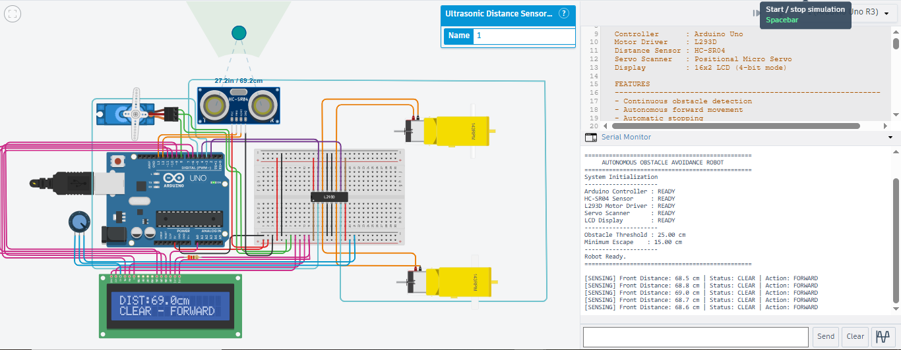
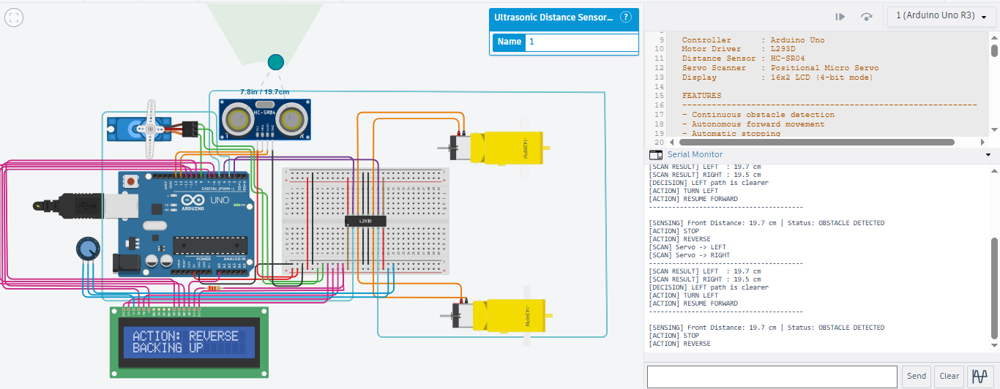
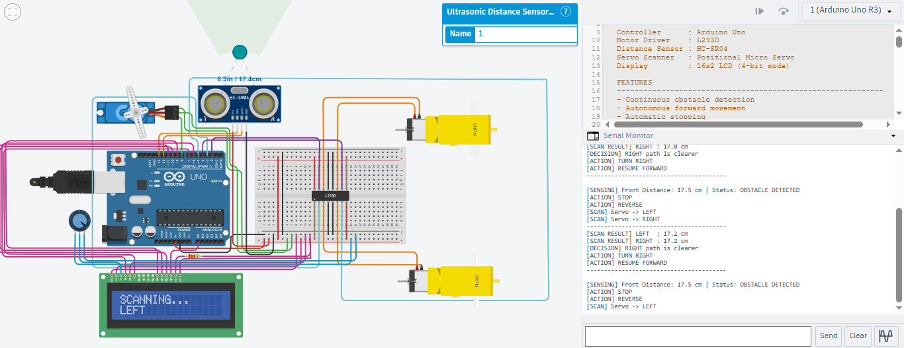
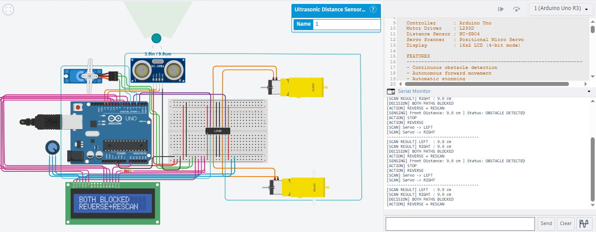
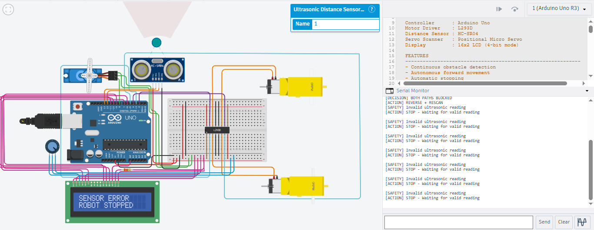

# Autonomous Obstacle Avoidance Robot

An Arduino Uno based autonomous obstacle avoidance robot prototype developed and validated in Tinkercad simulation.

The system continuously measures the distance in front of the robot using an HC-SR04 ultrasonic sensor. When an obstacle is detected, the robot stops, reverses, scans the left and right sides using a servo-mounted sensor concept, compares the available distances, and selects the clearer path. A 16x2 LCD and the Arduino Serial Monitor provide real-time status feedback.

## Project Status

**Working prototype - simulation tested in Tinkercad.**

The current repository documents the simulation implementation and the tested control logic. Physical hardware assembly is not claimed as part of this repository.

## Objectives

1. Detect obstacles continuously using an HC-SR04 ultrasonic sensor.
2. Stop automatically when an obstacle enters the safety threshold.
3. Reverse to create additional clearance.
4. Scan alternative paths to the left and right using a micro servo.
5. Compare left and right distances and select the clearer path.
6. Turn toward the selected path and resume forward movement.
7. Handle cases where both escape paths are blocked.
8. Stop safely when a valid ultrasonic reading cannot be obtained.
9. Display robot status locally on a 16x2 LCD.
10. Provide detailed diagnostics through the Arduino Serial Monitor.

## Hardware Components

| Component | Quantity | Purpose |
|---|---:|---|
| Arduino Uno R3 | 1 | Main controller |
| HC-SR04 Ultrasonic Sensor | 1 | Front obstacle detection and directional scanning |
| L293D H-Bridge Motor Driver | 1 | Independent control of two DC motors |
| DC Hobby Gearmotors | 2 | Robot drive motors |
| Positional Micro Servo | 1 | Moves the ultrasonic sensor between scan directions |
| 16x2 LCD | 1 | Robot state and distance display |
| 10 kOhm Potentiometer | 1 | LCD contrast control |
| 220 Ohm Resistor | 1 | LCD backlight current limiting |
| Breadboard | 1 | Prototyping and power distribution |
| Jumper Wires | As required | Electrical connections |

## Pin Configuration

### Motor Driver

| Arduino Pin | L293D Signal |
|---|---|
| D3 | Input 1 |
| D5 | Input 2 |
| D4 | Input 3 |
| D2 | Input 4 |

### Ultrasonic Sensor

| HC-SR04 Pin | Arduino / Supply |
|---|---|
| VCC | +5V |
| TRIG | D13 |
| ECHO | D12 |
| GND | GND |

### Servo

| Servo Connection | Arduino / Supply |
|---|---|
| Signal | D8 |
| Power | +5V |
| Ground | GND |

### 16x2 LCD

The LCD is operated in 4-bit mode.

| LCD Pin / Signal | Arduino / Supply |
|---|---|
| 1 - VSS / GND | GND |
| 2 - VCC / VDD | +5V |
| 3 - V0 | Potentiometer wiper |
| 4 - RS | D6 |
| 5 - RW | GND |
| 6 - E | D7 |
| 7-10 - D0 to D3 | Not connected |
| 11 - DB4 / D4 | D9 |
| 12 - DB5 / D5 | D10 |
| 13 - DB6 / D6 | D11 |
| 14 - DB7 / D7 | A0 |
| 15 - LED+ / A | +5V through 220 Ohm resistor |
| 16 - LED- / K | GND |

### LCD Potentiometer

- One outer pin -> +5V
- Middle pin / wiper -> LCD V0
- Other outer pin -> GND

## Locked Engineering Parameters

| Parameter | Value |
|---|---:|
| Obstacle threshold | 25 cm |
| Minimum escape distance | 15 cm |
| Servo center | 90 degrees |
| Servo left scan | 160 degrees |
| Servo right scan | 20 degrees |
| Reverse time | 500 ms |
| Turn time | 600 ms |
| Ultrasonic samples per decision | 3 |
| Maximum accepted distance | 250 cm |

## Working Principle

### 1. Forward Detection

The ultrasonic sensor faces forward and the Arduino takes averaged distance measurements.

- Distance > 25 cm -> path considered clear -> move forward.
- Distance <= 25 cm -> obstacle detected -> begin avoidance.

### 2. Obstacle Response

When an obstacle is detected:

1. Stop.
2. Reverse for 500 ms.
3. Stop briefly.
4. Rotate the servo to the left scan position.
5. Measure the left distance.
6. Rotate the servo to the right scan position.
7. Measure the right distance.
8. Compare the two paths.

### 3. Path Selection

- Left distance > right distance -> turn left.
- Right distance > left distance -> turn right.
- Approximately equal distances -> default to right.
- Both distances < 15 cm -> both paths considered blocked -> reverse and rescan.

### 4. Sensor Safety

If no valid ultrasonic measurement is obtained, the robot stops instead of treating the failed reading as an open path.

## LCD Output

The LCD provides compact local feedback, for example:

```text
DIST:56.1cm
CLEAR - FORWARD
```

```text
DIST:21.0cm
OBSTACLE DET
```

```text
SCANNING...
LEFT
```

```text
PATH: RIGHT
TURNING RIGHT
```

```text
BOTH BLOCKED
REVERSE+RESCAN
```

```text
SENSOR ERROR
ROBOT STOPPED
```

## Serial Monitor

The Serial Monitor runs at **9600 baud** and provides detailed diagnostics including sensor readings, obstacle status, scan results, path decisions, and robot actions.

Example:

```text
[SENSING] Front Distance: 24.3 cm | Status: OBSTACLE DETECTED
[ACTION] STOP
[ACTION] REVERSE
[SCAN] Servo -> LEFT
[SCAN] Servo -> RIGHT
[SCAN RESULT] LEFT  : 24.0 cm
[SCAN RESULT] RIGHT : 24.3 cm
[DECISION] RIGHT path is clearer
[ACTION] TURN RIGHT
[ACTION] RESUME FORWARD
```

## Simulation Evidence

The following screenshots document the tested circuit and the major operating states of the robot in Tinkercad simulation.

### Complete Circuit


### Clear Path and Forward Movement



### Obstacle Detection and Reverse Action



### Left Path Selected


### Right Path Selected



### Both Paths Blocked



### Invalid Sensor Reading Safety Response



### LCD Output Close-up


## Testing Summary

The simulation was tested against the major operating conditions required by the project.

| Test Case | Expected Behaviour | Result |
|---|---|---|
| Clear path | Forward movement | Passed |
| Obstacle within 25 cm | Stop and reverse | Passed |
| Left path clearer | Turn left | Passed |
| Right path clearer | Turn right | Passed |
| Approximately equal paths | Default right turn | Passed |
| Both paths below 15 cm | Reverse and rescan | Passed |
| Invalid ultrasonic reading | Stop and wait for valid reading | Passed in simulation |
| LCD state reporting | Display current robot state | Passed |
| Serial diagnostics | Report real-time status | Passed |

For the detailed test procedure and observations, see [TEST_RESULTS.md](TEST_RESULTS.md).

## Important Simulation Note

Tinkercad is used as the development and validation environment. The simulation demonstrates the electrical connections, sensor measurements, control decisions, motor commands, servo positioning commands, LCD output, and Serial Monitor behaviour.

The virtual environment does not physically model a complete moving robot chassis with a servo-mounted sensor in the same way as real hardware. Therefore, repeated obstacle detections can occur when the virtual target remains in front of the simulated sensor after a turn. This is a limitation of the simulation environment rather than a change to the programmed decision logic.

## Source Code

The complete Arduino sketch is available in:

[`final.ino`](final.ino)

The circuit connections and pin mapping are documented in [CIRCUIT_AND_PINOUT.md](CIRCUIT_AND_PINOUT.md).

## Repository Structure

```text
autonomous-obstacle-avoidance-robot/
|-- README.md
|-- final.ino
|-- CIRCUIT_AND_PINOUT.md
|-- TEST_RESULTS.md
`-- images/
    |-- final-circuit.png
    |-- clear-forward.png
    |-- obstacle-detected.png
    |-- path-left.png
    |-- path-right.png
    |-- both-blocked.png
    |-- sensor-error.png
    `-- lcd random closeup output.png
```

## Limitations

- The current implementation is validated in Tinkercad simulation rather than claimed as a completed physical robot build.
- Turn angle and motor timing are simulation parameters and would require tuning on a real chassis.
- The LCD has limited space, so detailed diagnostics remain on the Serial Monitor.
- The current robot does not use wheel encoders, so motor RPM is not physically measured.

## Future Enhancements

Possible future improvements include:

- Physical chassis implementation and motor-power integration.
- Wheel encoders for actual RPM measurement and closed-loop speed control.
- More robust distance filtering and threshold hysteresis.
- Maze solving or path optimization.
- Bluetooth or Wi-Fi control.
- IoT/cloud monitoring.
- Additional sensors for wider obstacle coverage.

## Author

**Aaditya Dolhare**

GitHub: [@aadityadolhare](https://github.com/aadityadolhare)

## Reference and Development Note

The initial circuit architecture was studied from publicly available obstacle-avoidance examples in Tinkercad. The project was subsequently modified, tested, and developed into the configuration documented in this repository, including the servo-assisted scan logic, safer path-selection rules, LCD integration, and simulation validation.
